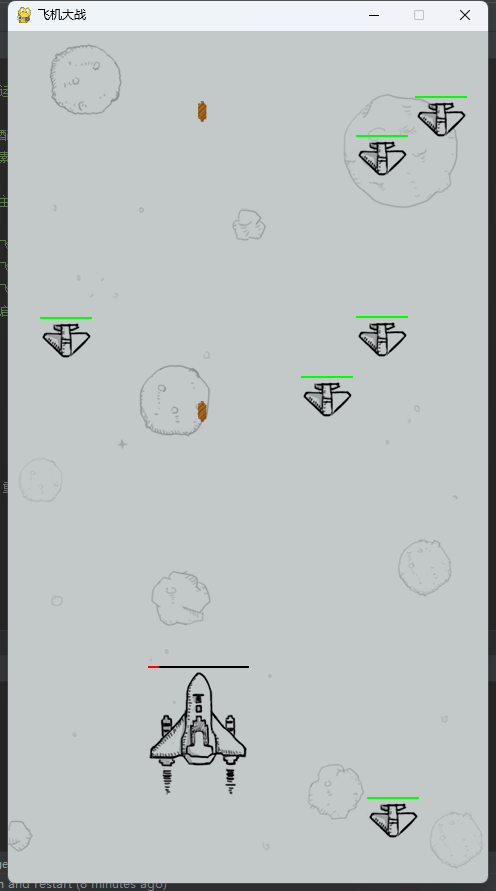
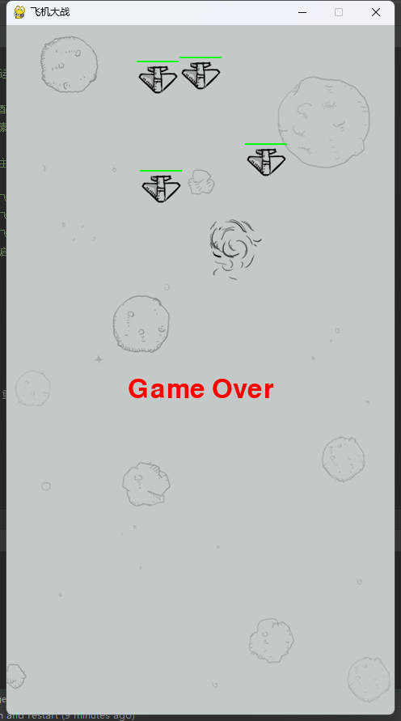

## 基于PyGame的飞机大战游戏

在 [triaquae/jerkoff](https://github.com/triaquae/jerkoff) 基础上做了一些修改：

1、修复游戏中窗口无法关闭的问题

2、我方飞机添加血量显示

3、加入游戏结束提示

4、游戏结束2s后自动初始化游戏（重新开始）

###  环境依赖
`pip install pygame`

#### 运行
`python manage.py`

#### 截图

